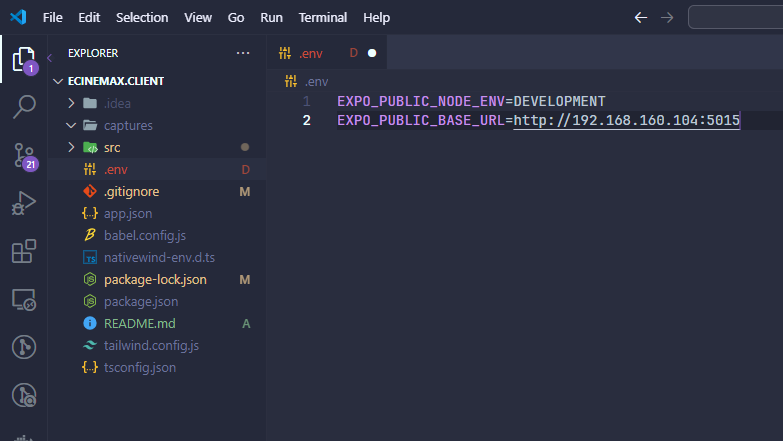

#### Setup environment:

1. Create .env in root project
2. Copy 2 lines:

   > EXPO_PUBLIC_NODE_ENV=DEVELOPMENT

   > EXPO_PUBLIC_BASE_URL=http://host:port

3. Replace 'host' with your local IP address and 'port' with server port

###### Example:

